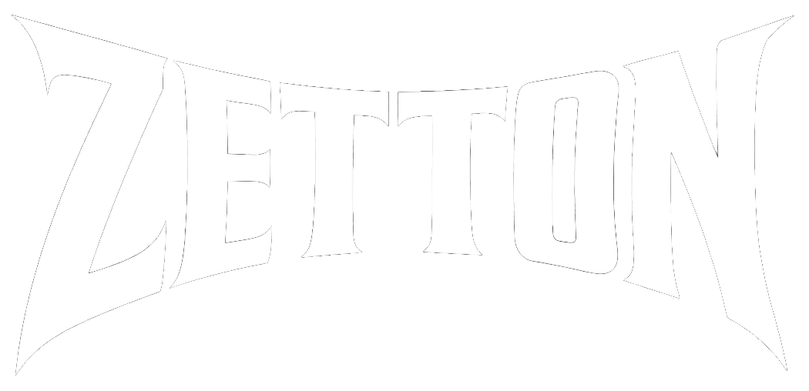

# Zetton 

> **⚠️ Active Development**: Zetton is in active alpha development. The CLI is functional, but some advanced features are still being implemented. See the [Roadmap](#roadmap) for current status.

## Quantum Software Reverse Engineering Framework

A next-generation reverse engineering framework that combines classical binary analysis with quantum computing algorithms. Zetton bridges the gap between traditional tools like Ghidra and the emerging capabilities of quantum computers for enhanced cryptanalysis and pattern detection.

---

## Features

### Quantum Engine
- Qiskit-based circuit construction
- Local simulation via Aer backend
- Hardware backend support (IBM Quantum, AWS Braket)
- Hybrid classical-quantum algorithm orchestration

### Forensics Modules
- Crypto constant detection and extraction
- Key schedule analysis
- Implementation weakness identification
- PQC algorithm fingerprinting

### Command Line Interface
- ✅ Binary analysis framework
- ✅ Configuration management
- ✅ Quantum backend integration
- 🚧 Advanced analysis features (in progress)

---

## Installation

### Prerequisites

Ensure you have Python 3.9+ and required system packages:

```bash
# On Kali Linux / Debian / Ubuntu
sudo apt update
sudo apt install -y python3 python3-pip python3-venv build-essential git
```

### Step-by-Step Installation

#### 1. Clone the Repository

```bash
git clone https://github.com/keebanvillarreal/zetton.git
cd zetton
```

#### 2. Create Virtual Environment

**⚠️ Important**: On Kali Linux and modern Debian-based systems, you **must** use a virtual environment to avoid the "externally-managed-environment" error.

```bash
# Create virtual environment
python3 -m venv zetton-env

# Activate it
source zetton-env/bin/activate
```

Your prompt should now show `(zetton-env)` indicating the environment is active.

#### 3. Install Zetton

```bash
# Upgrade pip first
pip install --upgrade pip setuptools wheel

# Install Zetton in development mode
pip install -e .

# Or install with all optional features (recommended)
pip install -e ".[all]"
```

#### 4. Verify Installation

```bash
# Check version
zetton --version

# View available commands
zetton --help

# Check system status
zetton status
```

You should see output confirming Zetton v0.1.0 is installed.

---

## Getting Started

### Daily Usage

Every time you want to use Zetton, activate the virtual environment:

```bash
cd ~/zetton
source zetton-env/bin/activate
```

When you're done:

```bash
deactivate
```

### First Steps

Try these commands to explore Zetton:

```bash
# 1. Check what's available
zetton --help

# 2. View system status
zetton status

# 3. See quantum backends
zetton quantum list-backends

# 4. View configuration options
zetton config --list
```

---

## Command Line Interface

### Available Now ✅

```bash
# Display version
zetton --version

# Show help
zetton --help

# Check feature status
zetton status

# Configuration management
zetton config --list
zetton config --key ibm-token --value YOUR_TOKEN

# Quantum backends
zetton quantum list-backends
zetton quantum test-backend
```

### In Development 🚧

These commands exist but show "under development" messages:

```bash
# Binary analysis (coming soon)
zetton analyze ./malware_sample

# Crypto detection (coming soon)
zetton crypto-detect ./binary --quantum

# Forensics reports (coming soon)
zetton forensics --output report.html ./target
```

---

## Quick Start Examples

### Example 1: Check Installation

```bash
source zetton-env/bin/activate
zetton status
```

### Example 2: View Quantum Backends

```bash
zetton quantum list-backends
```

### Example 3: Configure IBM Quantum

```bash
# Get token from https://quantum.ibm.com/
zetton config --key ibm-token --value YOUR_IBM_QUANTUM_TOKEN
```

### Python API (Coming Soon)

The target Python API will look like this:

```python
from zetton import Zetton
from zetton.quantum import GroverSearch

# Load a binary
z = Zetton("target_binary")

# Perform analysis
z.analyze()

# Quantum-assisted crypto search
searcher = GroverSearch(z.quantum_engine)
results = searcher.find_crypto_constants(
    z.binary_data,
    pattern_type="aes_sbox"
)

# Generate report
z.forensics.generate_report("analysis_report.html")
```

---

## Architecture

```
zetton/
├── analyzers/      # Analysis engines (in development)
│   ├── disasm.py   # Disassembly engine
│   ├── cfg.py      # Control flow analysis
│   └── dataflow.py # Data flow analysis
├── core/           # Core framework components
│   ├── binary.py   # Binary representation
│   ├── project.py  # Project management
│   └── config.py   # Configuration handling
├── crypto/         # Cryptanalysis tools
│   ├── identify.py # Algorithm identification
│   ├── constants.py# Crypto constants database
│   └── pqc.py      # Post-quantum crypto analysis
├── forensics/      # Digital forensics modules
│   ├── crypto.py   # Cryptographic analysis
│   ├── timeline.py # Event reconstruction
│   └── report.py   # Report generation
├── loaders/        # Binary format parsers
│   ├── elf.py      # ELF loader
│   ├── pe.py       # PE/COFF loader
│   └── macho.py    # Mach-O loader
├── quantum/        # Quantum computing components
│   ├── engine.py   # Quantum execution engine
│   ├── circuits.py # Pre-built circuits
│   ├── grover.py   # Grover's algorithm
│   └── qaoa.py     # QAOA optimization
├── utils/          # Utility functions
├── cli.py          # Command-line interface ✅
└── __init__.py     # Package initialization ✅
```

---

## Quantum Algorithms

| Algorithm | Application | Theoretical Speedup |
|-----------|-------------|---------------------|
| Grover's Search | Pattern matching, constant finding | O(√N) |
| Quantum Counting | Solution estimation | O(√N) |
| QAOA | SAT solving, constraint optimization | Problem-dependent |
| VQE | Ground state problems | Exponential (certain cases) |
| Quantum Walks | Graph traversal in CFG | O(√N) |

### Quantum Backend Modes

1. **Simulation Mode** (Default): Local quantum simulation using Qiskit Aer. Best for development and testing.

2. **Hybrid Mode**: Classical preprocessing with quantum acceleration for specific subtasks. Optimal balance of practicality and capability.

3. **Hardware Mode**: Real quantum hardware via IBM Quantum or AWS Braket. For problems beyond classical simulation capacity.

---

## Roadmap

### ✅ Completed
- [x] Project structure and packaging (pyproject.toml, setup.py)
- [x] Command-line interface with Click
- [x] Rich terminal output formatting
- [x] Configuration management framework
- [x] Quantum backend listing
- [x] Package installation and distribution

### 🚧 In Progress
- [ ] Binary format loading (ELF, PE, Mach-O)
- [ ] Capstone disassembly integration
- [ ] Quantum engine implementation
- [ ] Configuration file handling

### 📋 Planned
- [ ] Crypto constant database
- [ ] CFG/DFG analysis
- [ ] Grover's search implementation
- [ ] QAOA constraint solver
- [ ] PQC analysis module
- [ ] Integration with radare2, YARA, Volatility
- [ ] GUI interface
- [ ] Ghidra interoperability
- [ ] PyPI publication

---

## Troubleshooting

### Common Issues

**Error: "externally-managed-environment"**
```
Solution: Always use a virtual environment on Kali/Debian systems
→ python3 -m venv zetton-env && source zetton-env/bin/activate
```

**Error: "No module named 'zetton.cli'"**
```
Solution: Make sure the zetton package directory has cli.py and __init__.py
→ ls zetton/cli.py zetton/__init__.py
```

**Error: "command not found: zetton"**
```
Solution: Reinstall after activating virtual environment
→ source zetton-env/bin/activate
→ pip install -e . --force-reinstall
```

**Module import errors (rich, click, qiskit)**
```
Solution: These should auto-install, but if not:
→ pip install click rich qiskit qiskit-aer
```

### Getting Help

- **Issues**: Report bugs at [GitHub Issues](https://github.com/keebanvillarreal/zetton/issues)
- **Email**: keeban.villarreal@my.utsa.edu
- **Contributing**: See [CONTRIBUTING.md](CONTRIBUTING.md)

---

## Research Applications

Zetton is designed for security researchers working on:

- **Malware Analysis**: Quantum-accelerated pattern matching for signature detection
- **Vulnerability Research**: Constraint solving for path exploration
- **Cryptographic Auditing**: Implementation weakness detection
- **Post-Quantum Security**: PQC algorithm verification and analysis
- **Digital Forensics**: Evidence extraction and timeline reconstruction

---

## Contributing

We welcome contributions from the security and quantum computing communities!

### Who Can Contribute?

- **UTSA Students**: Join the Cyber Jedis Quantum Cybersecurity Team
- **Security Researchers**: Contribute analysis techniques and patterns
- **Quantum Developers**: Help optimize quantum algorithms
- **Everyone**: Documentation, testing, bug reports are all valuable!

See [CONTRIBUTING.md](CONTRIBUTING.md) for detailed guidelines.

### Quick Start for Contributors

```bash
# Fork and clone your fork
git clone https://github.com/YOUR_USERNAME/zetton.git
cd zetton

# Setup development environment
python3 -m venv venv
source venv/bin/activate
pip install -e ".[dev]"

# Make your changes
git checkout -b feature/your-feature

# Test your changes
pytest tests/

# Submit a pull request
```

---

## License

MIT License - see [LICENSE](LICENSE) for details.

This project is open source and welcomes contributions under the MIT license.

---

## Acknowledgments

- **Ghidra Team** (NSA) - For pioneering open-source reverse engineering tools
- **Qiskit Team** (IBM) - For the quantum computing framework
- **Capstone Team** - For the disassembly engine
- **UTSA Cyber Jedis** - For quantum cybersecurity research
- **Quantum & Security Communities** - For ongoing support and collaboration

---

## About

**Zetton** is developed by the **UTSA Cyber Jedis Quantum Cybersecurity Team**, a group of researchers exploring the intersection of quantum computing and digital security.

**Contact**: keeban.villarreal@my.utsa.edu  
**Repository**: https://github.com/keebanvillarreal/zetton

---

*"Even Ultraman couldn't defeat Zetton alone."*
